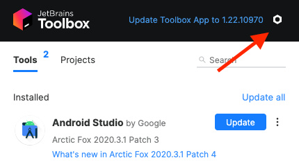
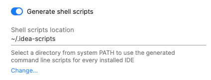
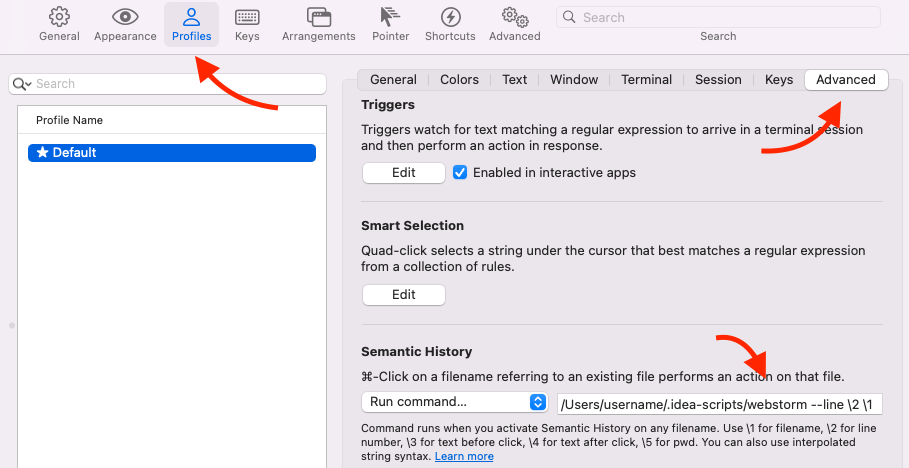

 > This instruction should work for all of the JetBrains IDEs (IntelliJ IEDA, WebStorm, PhpStorm, PyCharm).

Most of the modern IDEs and code editors have an integrated terminal feature. But, there are still people who like to use terminals outside of IDE. It happens for multiple various reasons: more detailed customization, easier to switch between projects, avoiding accidental processes termination on editor close, etc.

When it comes to macOS terminal apps, the most popular pick is iTerm. It's famous for its amazing features and flexible customization. But unfortunately, by default, iTerm cannot open files in the JetBrains IDEs via ⌘ + Click (it works by default with VSCode thought). But there is a way to fix that.

## Configure Shell script location

1. Open the **Toolbox App** and click on the settings icon in the top right corner.



2. In the **Toolbox App Settings**, enable **Generate shell scripts**.
3. If necessary, change the shell scripts location.



## Change iTerm Settings

After we’ve configured our shell script generation, now we need to switch to iTerm.

1. Go to **Preferences** > **Profiles** > **Advanced**.
2. In the **Semantic History** select the **“Run command...”** option.
3. In the same section type the following command:

```
<path_shell_script_location>/<ide_name> --line \2 \1
```

In my case I use WebStorm, so the final command looks like that:

```
/Users/username/.idea-scripts/webstorm --line \2 \1
```



**Note 1:** the `--line \2 \1` part allows not only open a file but put a cursor on a certain line. Unfortunately, there’s no option to automatically place a caret at a certain character location.

**Note 2:** if the approach above doesn't work, then you need to define a direct path to your IDE within the `Applications` folder:

```
/Applications/IntelliJ\ IDEA.app/Contents/MacOS/idea  --line \2 \1
```
