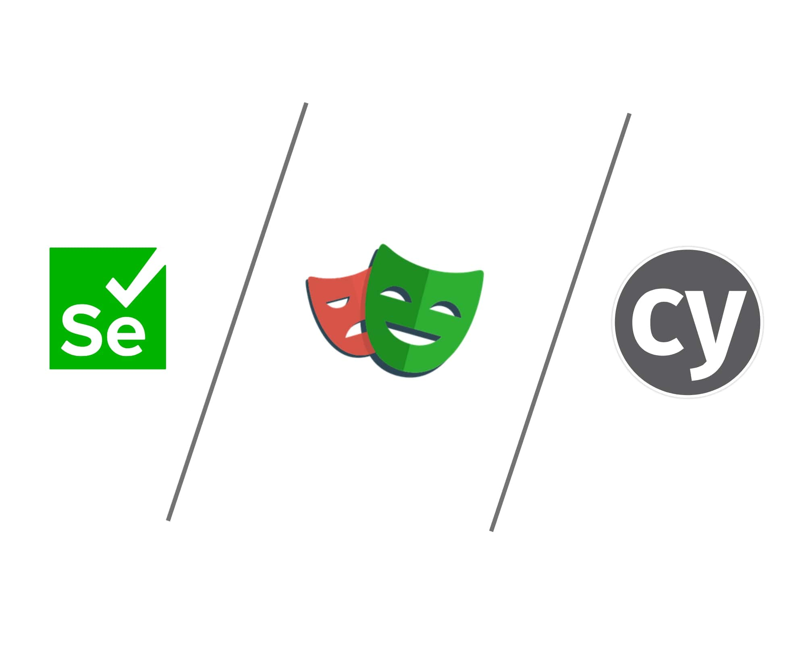

Since you decided to read this article you probably know that the Angular team plans to end the development of Protractor at the end of 2022.

But, first, why cannot you keep on using Protractor, even though it’s not going to be supported any longer? Here some of the reasons:

1. Use of a non-maintained project may be a security breach.
2. At some point in time, your tests won’t be able to run in modern browsers’ versions and won’t support new features.
3. Today, there are a lot of attractive alternatives that have plenty of new features that can simplify developers’ life.

## Requirements
I used this list of requirements and nice-to-haves as metrics for comparing different e2e testing frameworks:

* Easy learning curve
* Well documented
* Popular / Actively maintained
* Fast
* Reliable / Produces no flaky tests
* Has vital features
	* Possible to implement/imitate  `waitForAngular`
	* Ability to change the window size
	* Multiple tabs/windows support
	* Screenshots capturing

### Easy learning curve
More a tool is complicated – more time it will take to learn it and start writing high-quality tests.

### Well documented
This point comes from the previous one. If a tool is poorly documented, then it makes it harder to work with and to understand its possibilities.

### Popular
Community is a very important indicator of how actively maintained the project is going to be. A larger community means more contributors, more significant interest in the project, more raised issues, and more information on how to solve specific problems.

### Fast
Faster tests run faster we deliver new features. It’s very important in the case of actively scaling projects where the Jenkins “Tests” pipeline may take up to a couple of hours to complete.

### Reliable / Produces no flaky tests
Flaky test – a test that sometimes fails, but if you retry it enough times, it passes, eventually. Of course, we would like to have as less such “magical” behavior as possible.

### Features
I picked the next features to be considered because it’s something you would most likely need in any Angular project:

**Possible to implement/imitate waitForAngular** – original implementation tells to a test runner to wait until Angular has finished rendering and has no outstanding $http or $timeout calls. We need it to handle some edge cases, caused by Angular’s specificity in working with async code.

**Ability to change window size** – it’s very handy when you need to test your pages for a mobile view.

**Multiple tabs/windows support** – this feature is vital if your project uses WebSockets and you need to check the communication between two or more browser instances.

**Screenshots capturing**. Sometimes looking at a screenshot helps you to quickly detect why a particular test failed.

If you need more advanced features like multi-browser support or the ability to test iframes and shadow DOM, you may need to have a deeper dive into existing e2e frameworks.

## Considered Frameworks
There are tens of active testing frameworks on the market right now. I’ve picked 3 projects which I found to be very suitable according to the aforementioned requirements.

* Cypress
* Playwright
* Silenium-webdriwer

> **⚠️ Important Note**
> I dropped **webdriverio** and **puppeteer** frameworks out of the contest, even though they’re quite popular, for the next reason:
>
> **webdriverio** – is based on Silenium as well as Silenium-webdriwer. The problem with it is that it is hard to set up, and it requires effort to make it work with TypeScript. Also, I find its syntax not very pleasant to work with.
>
> **puppeteer** – people who developed puppeteer in Google moved to Microsoft to start work on Playwright (forked from puppeteer). These two projects share mostly the same API, but Playwright is more concentrated on e2e testing, rather than on automotive testing as puppeteer does. Also, it looks like Playwright has beaten puppeteer in popularity and growth rate.

## Cypress
Cypress is currently the most popular framework for e2e testing. It has 39k stars and 2.4k forks on GitHub and a very active community as well.

Cypress is quite different in its approach to run tests. When you run a script inside the browser, the script is executed in the same loop as your application. Also, Cypress is very well-known for its in-browser debugging tools. The tools make it easier to spot where you have incorrect behavior. Also, Cypress provides you native access to each object without dealing with over-the-wire protocols.

Unfortunately, Cypress is not able to run two or more instances of a browser. It means that it’s not possible to test WebSockets behavior using two different tabs/windows. At the same time, Cypress is much slower in running tests comparing it to other contestants. Also, Cypress seems to be less stable and produces more flaky results. Also, the chaining syntax used reminds me a lot of jQuery, which feels a bit outdated nowadays.

<b>Pros:</b>

* Offers real-time debugging of apps by taking snapshots as your tests run
* Developer-friendly interface
* Good documentation
* API testing capabilities
* Very popular and has an active community

<b>Cons:</b>

* Slower than other frameworks
* No support for multi-tabs
* People find it less reliable than other solutions
* jQuery-like syntax
* Can’t navigate to a different domain URL
* Package bloated with dependencies  (143 dev-deps)
* Has paid features
* Cannot be run in headless mode

## Playwright
Playwright is the youngest of presented frameworks and maintained by Microsoft. Developers who worked on this project moved from another popular testing project called Puppeteer (developed by Google). Playwright was forked from Puppeteer, but it is relatively different from it. The main difference is that Playwright was made specifically for end-to-end testing.

Although the project is on version 1.22, it’s growing very fast in terms of new feature development. It has 39.3 stars and 1.8k. forks on GitHub.

Also, Playwright provides parallelization which makes tests run blazing-fast, comparing it to other frameworks.

<b>Pros:</b>

* Maintained by a big company
* Very quick tests running
* Syntax similar to Protractor
* Supports multi-tabs
* Can be run in headless mode
* Has an auto-wait mechanism
* Produces less number of flaky tests
* Supports parallelization (locally as well)
* Completely free
* Has few dependencies
* You can easily change a test runner

<b>Cons:</b>

* Newest of the presented frameworks
* Has smaller community
* Documentation is not that good as for Cypress

## Selenium-webdriver
In terms of APIs, selenium-webdriver is most similar to Protractor. The reason for that is that Protractor uses selenium-webdriver under the hood. We easily can replace the Protractor methods with those selenium-webdriver provide. Although they are not 1:1 replacements, they are very close.

<b>Pros:</b>

* Syntax is mostly similar to Protractor
* If you've worked with Protractor, you already have an idea of possible issues you may have
* Long time on the market

<b>Cons:</b>

* Relatively slow
* Creating test cases is more time-consuming
* Difficult to set up test environment as compared to Cypress/Playwright
* Hard to debug failed tests
* Often produces flaky tests

## Conclusion
**Cypress.** Even though Cypress is the most popular framework for testing web applications and is considered a new industry standard, it still has some sufficient limitations (no multi-tab support, cannot navigate to other domains). Also, it has a lack of flexibility, which will cause you to find workarounds for limitations induced by the specificity of Cypress.

**Playwright**. Playwright is flexible, very fast, and actively delivers new features. It’s relatively new but it very quickly became a favorite choice of many developers.

**Selenium-webdriver**.  Selenium-webdriver is there for many years and would be a solid decision, but the industry of automative testing has gone far ahead. Many alternatives are faster, more reliable, and have richer tooling. But if your goal is just to migrate away from Protractor in the quickest way, it would be the right choice.

Cypress and Selenium-webdriver have many good qualities and would be a  pick for your next e2e testing framework, but considering everything aforementioned, I find **Playwright** the most solid pick here.
